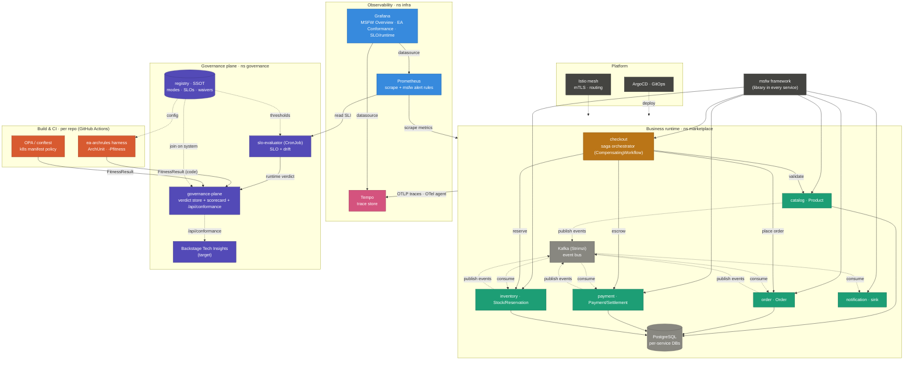

# Estate Landscape

Every component currently running across the estate — business runtime, platform, observability,
tracing, governance, and CI — in one picture. For the deeper per-area views see
[SYSTEM_VIEW.md](SYSTEM_VIEW.md) (EA program), the msfw `docs/MODULE_VIEW.md`, and the marketplace
`docs/CONTEXT_MAP.md`.

## Planes (by colour)

- 🟧 **Orchestrator** — `checkout` (synchronous `CompensatingWorkflow` over four contexts).
- 🟩 **Business services** — catalog, order, payment, inventory, notification (each its own aggregate + DB).
- ⬜ **Data / messaging** — Kafka (Strimzi) event bus, PostgreSQL per-service DBs.
- ⬛ **Platform** — the msfw framework (library in every service), Istio mesh, ArgoCD (GitOps).
- 🔵 **Observability** — Prometheus (scrape + alert rules), Grafana (MSFW Overview · EA Conformance · SLO/runtime dashboards).
- 🩷 **Tracing** — OpenTelemetry Java agent in each pod → Tempo → Grafana.
- 🟪 **Governance plane** — registry (SSOT), governance-plane (durable verdict store + scorecard + `/api/conformance`), slo-evaluator CronJob, Backstage Tech Insights (target).
- 🟥 **Build / CI** — ea-archrules harness (ArchUnit, `-Pfitness`), OPA/conftest.

## Main flows

- **Business** — checkout orchestrates four services synchronously (solid); services publish/consume
  domain events over Kafka (dashed); state in PostgreSQL.
- **Observability** — Prometheus scrapes metrics; the OTel agent exports OTLP traces to Tempo;
  Grafana reads both as datasources.
- **Governance** — `FitnessResult` verdicts from the **static** tier (CI: harness + OPA) **and** the
  **runtime** tier (slo-evaluator reading Prometheus) land in the **governance-plane** store/scorecard,
  keyed on the **registry** `system` id, heading toward Backstage. Per
  [ADR 0001](adr/0001-governance-plane.md): CI never writes into the prod cluster, and the governance
  plane is separate from prod observability.

> The early Pushgateway was scaffolding, replaced by the governance-plane per ADR 0001 — it is not
> shown here; this is the running target architecture.
