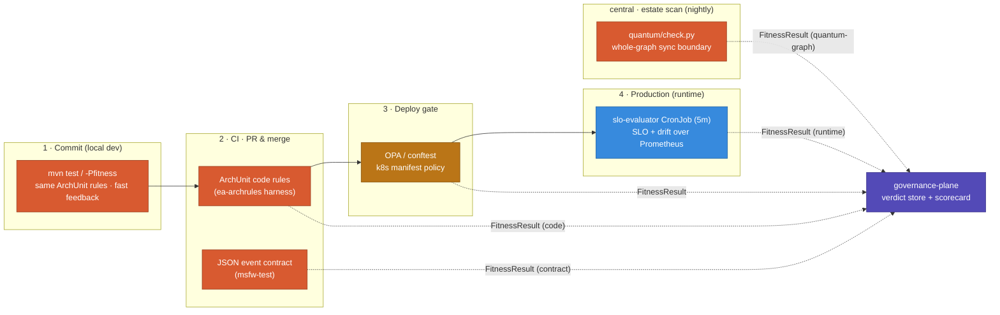

# Fitness Functions — Type, Placement & Lifecycle Phase

What kind of fitness function each one is (Ford taxonomy), **where** it is deployed, and **at which
phase of the system lifecycle** it runs. Companion to [FITNESS.md](../FITNESS.md) (the rule catalogue)
and [SYSTEM_VIEW.md](SYSTEM_VIEW.md) (the planes). Every function emits the same
[`FitnessResult`](fitness-result.md) verdict into the governance plane.

## Taxonomy (Ford)

- **atomic** = checks one component in isolation · **holistic** = a system-wide property.
- **static** = inspects structure/artifacts (no running system) · **dynamic** = observes a running system.
- **triggered** = runs on an event (commit, PR, deploy) · **continuous** = runs on a schedule / always-on.

## Where each runs across the lifecycle

## Catalogue

### Static · code tier — phase: **commit + CI** (`ea-archrules` harness, ArchUnit)
Deployed as each repo's `…/architecture/FitnessFunctionsTest` (runs on every `mvn test`, gated in CI
`fitness.yml`); msfw governs itself via the `-Pfitness` profile.

| Function | Ford type | Catches | Default mode |
|---|---|---|---|
| `domainIsPure` | atomic · static · triggered | domain leaking into Spring/Jakarta/Kafka | enforce |
| `useCaseSliceIsolation` | atomic · static · triggered | use-case slices cross-depending | enforce |
| `aggregateEncapsulation` | atomic · static · triggered | public setters on an Aggregate | enforce |
| `entityEncapsulation` | atomic · static · triggered | public setters on an Entity | enforce |
| `stateWritersPublish` | atomic · static · triggered | state-writing use-case not `@EventPublishHandler` | enforce (warn+waiver where adopting) |
| `quantumSyncBoundary` | atomic · static · triggered | a `..outbound.client..` calling a quantum **not** in the system's registry `allowedSyncQuanta` | enforce |
| `eventStoreInQuantum` | atomic · static · triggered | an `EventSourcedRepository` reaching a cross-quantum `..outbound.client..` (event store escaping its quantum) | enforce |
| `msfwModuleGraph` (`moduleStaysWithin`) | holistic · static · triggered | the framework's own domain-core purity | enforce (`-Pfitness`) |

> **Caller-side quantum rules** read `spec.quantum.allowedSyncQuanta` from the registry — the architect
> declares each quantum's permitted synchronous neighbours there (SSOT), and the rule enforces it in the
> caller's own PR. They give *fast, local* feedback but only cover repos that adopt the harness; the
> whole-graph tier below is the estate-wide safety net.

### Static · contract tier — phase: **CI** (`msfw-test`)
| Function | Ford type | Where | Catches |
|---|---|---|---|
| `JsonEventContract` | atomic · static · triggered | producer & consumer unit tests | JSON event payload drift between services |

### Static · whole-graph tier — phase: **central CI / nightly** (`quantum/check.py`)
Runs in **ea-governance** itself (`.github/workflows/quantum-graph.yml`): clones every registered repo
into a workspace (`GH_REPO_PAT`, contents:read), reads each system's `quantum.id` + `allowedSyncQuanta`
from the registry, scans all `**/outbound/client/*ClientOa.java` across the estate, and fails if any
quantum makes a synchronous call to a quantum it was not granted — caught from **one place**, even if
the offending repo never adopted the caller-side harness. Emits `FitnessResult` (`rule:
quantumGraphSyncBoundary`, `source: quantum-graph`).

| Function | Ford type | Catches | Action |
|---|---|---|---|
| `quantumGraphSyncBoundary` | holistic · static · triggered | any cross-quantum synchronous edge in the **whole** estate graph not allowed by the registry | **fail** (estate-wide) |

> Caller-side (`quantumSyncBoundary`) and whole-graph are the **same boundary, two coverage models**:
> the first is fast per-PR feedback owned by each team; the second is the estate safety net owned by the
> platform/governance team. They complement — not replace — each other, and both defer *runtime*
> enforcement of the actual call to the future PEP tier (ZTA). See
> [ADR 0002](adr/0002-quantum-governance-operating-model.md) for who owns what and when each runs.

### Static · manifest tier — phase: **deploy gate** (OPA/conftest)
Deployed as `marketplace-aigen/deploy/policy/kubernetes.rego`, run by `make policy` / CI.
| Rule group | Ford type | Catches | Action |
|---|---|---|---|
| resource limits · no `:latest` · readiness probe | atomic · static · triggered | unsafe k8s manifests | **deny** |
| `prometheus.io/scrape` · liveness probe | atomic · static · triggered | missing observability/health wiring | **warn** |

> At estate scale this tier graduates to **Kyverno admission** (cluster-side), not just CI.

### Dynamic · runtime tier — phase: **production** (slo-evaluator CronJob, reads Prometheus)
Deployed as `governance-plane/slo/slo-evaluator.py` (CronJob every 5 min, ns `governance`); thresholds
live in the registry `runtimeObjectives` (SSOT). Verdict to the governance plane; SLIs also on Grafana.

| Function | Ford type | SLI | Catches |
|---|---|---|---|
| `httpLatencyMax` | atomic · dynamic · continuous | `http_server_requests_seconds_max` | latency SLO breach |
| `outboxPendingLag` | atomic · dynamic · continuous | `msfw_outbox_pending_events` | publication lag |
| `outboxParked` | atomic · dynamic · continuous | `msfw_outbox_parked_events` | poison/parked events |
| `workflowCompensationFailed` | holistic · dynamic · continuous | `msfw_workflow_runs_total{outcome=compensation_failed}` | saga/workflow left indeterminate |
| `…Drift` (e.g. `httpLatencyMaxDrift`) | holistic · dynamic · continuous | SLI vs same query at `now-1h` | slow regression within the absolute threshold |

## Cross-cutting: the registry

Not a fitness function itself but the **mode + waiver engine** that wraps all of the above
(per-system in the [registry](../registry)):
- **warn → enforce** — a rule can run in `warn` (logged, non-blocking) while a cohort adopts, then flip
  to `enforce`.
- **time-boxed waivers** — an enforced rule is downgraded to `warn` until an `expires` date, then
  auto-reverts (e.g. F-4: `stateWritersPublish` on ecommerce-order-management until 2026-09-30).
- **coverage** — the scorecard flags systems registered but reporting no verdicts.

## One-line summary

| Phase | Tier | Runs where | Dynamic? |
|---|---|---|---|
| Commit | code | `mvn test` locally | static |
| CI (PR/merge) | code + contract | GitHub Actions `fitness.yml` per repo | static |
| Central / nightly | whole-graph | ea-governance `quantum-graph.yml` (clones the estate) | static, holistic |
| Deploy gate | manifest | OPA/conftest (`make policy`) | static |
| Production | runtime | slo-evaluator CronJob → Prometheus | dynamic, continuous |

All four feed one `FitnessResult` stream → the governance-plane scorecard, keyed on the registry
`system` id, so structure (build-time) and behaviour (run-time) read in a single conformance view.
