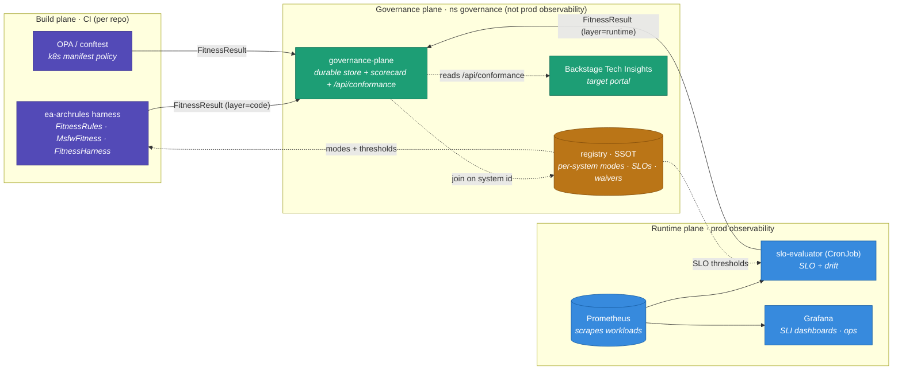

# EA Governance — System View

A bird's-eye view of the evolutionary-architecture program: what the pieces are, which **plane** each
lives in, and how a fitness verdict flows from where it's produced to where it's seen. The program is
**independent of what it governs** (governed → governance only; `ea-archrules` references msfw by
fully-qualified *name string*, zero compile dependency).

Deeper docs: [README](../README.md) · [FITNESS.md](../FITNESS.md) (rule catalogue) ·
[ADR 0001](adr/0001-governance-plane.md) (plane separation) ·
[fitness-result.md](fitness-result.md) (the verdict contract).

## The three planes

**How to read it:** solid arrows carry the **`FitnessResult` verdict contract** — the one shape every
emitter produces. Dotted arrows are reads / config.

- **Build plane (CI, in each governed repo):** the `ea-archrules` harness (ArchUnit) and OPA/conftest
  evaluate *structure* at build time and emit `code`-layer verdicts. **CI writes to the governance
  store over a controlled path — it never pushes into a production cluster** (ADR 0001).
- **Runtime plane (prod observability):** the `slo-evaluator` CronJob reads prod Prometheus, turns
  SLOs into `runtime`-layer verdicts (with drift detection), and emits the same contract. The raw
  SLIs stay in Prometheus/Grafana for ops.
- **Governance plane (its own namespace, *not* prod observability):** the **registry** is the SSOT
  (modes, thresholds, waivers); the **governance-plane** service is the durable verdict store + the
  cross-cohort scorecard + a Backstage-ready API. Static and runtime verdicts **meet only here**,
  keyed on the registry `system` id.

## Four enforcement tiers

| Tier | Where it runs | Emitter | Catches |
|---|---|---|---|
| **code** | CI (ArchUnit via `ea-archrules`) | `FitnessHarness` | architecture / module-graph violations |
| **contract** | CI (JSON fixtures, `msfw-test`) | producer/consumer tests | event payload drift |
| **runtime** | prod (Prometheus → SLO) | `slo-evaluator` | latency / lag / saturation, **drift** |
| **registry** | cuts across all | — | warn→enforce mode, time-boxed waivers, coverage |

## Component catalogue

| Component | Path | Role | Status |
|---|---|---|---|
| **FitnessRules** | `archrules/.../FitnessRules.java` | generic, stack-agnostic ArchUnit rules | published `0.3.0` |
| **MsfwFitness** | `archrules/.../MsfwFitness.java` | msfw-cohort profile (binds msfw FQNs as strings) | published |
| **FitnessHarness** | `archrules/.../FitnessHarness.java` | registry-driven warn→enforce; emits a verdict per eval | published |
| **FitnessResult / Sink** | `archrules/.../FitnessResult*.java` | the verdict contract + sink SPI (NOOP / stdout / ServiceLoader) | published |
| **registry** | `registry/*.yaml` | SSOT: owner/domain/P&L, per-rule mode, waivers, `runtimeObjectives` | YAML (→ catalog at scale) |
| **fitness-result contract** | `docs/fitness-result.{md,schema.json}` | the one flat event shape (code/contract/runtime) | v1 |
| **scorecard collector** | `scorecard/scorecard.py` | NDJSON + registry → conformance report / HTML / `--pushgateway` | CLI |
| **governance-plane** | `governance-plane/server.py` + `deploy/` | durable store (SQLite/PVC) + scorecard + `/api/conformance`, ns `governance` | prototype |
| **slo-evaluator** | `governance-plane/slo/` | CronJob: PromQL → `runtime` verdicts + drift | prototype |

## Independence (the load-bearing principle)

`ea-archrules` has **zero compile dependency** on msfw or any governed service — every framework
concept is a fully-qualified *name string*. Governed repos depend on the governance library (at test
scope), never the reverse. msfw even governs *itself* with it, gated behind a Maven `-Pfitness`
profile kept out of the release build — so the framework's publish never depends on the governance
library being reachable. Same stance will apply to the planned ZTA work: a separate project msfw/prod
depend on at a thin seam, not the other way round.

## Trajectory

Local experiment today → at estate scale: rule artifacts published centrally, the registry graduates
into a developer portal (Backstage Software Catalog + Tech Insights), runtime enforcement moves to
Kyverno admission, federated governance (central baseline + per-P&L extensions). The verdict contract
is the stable seam that survives all of those swaps.
